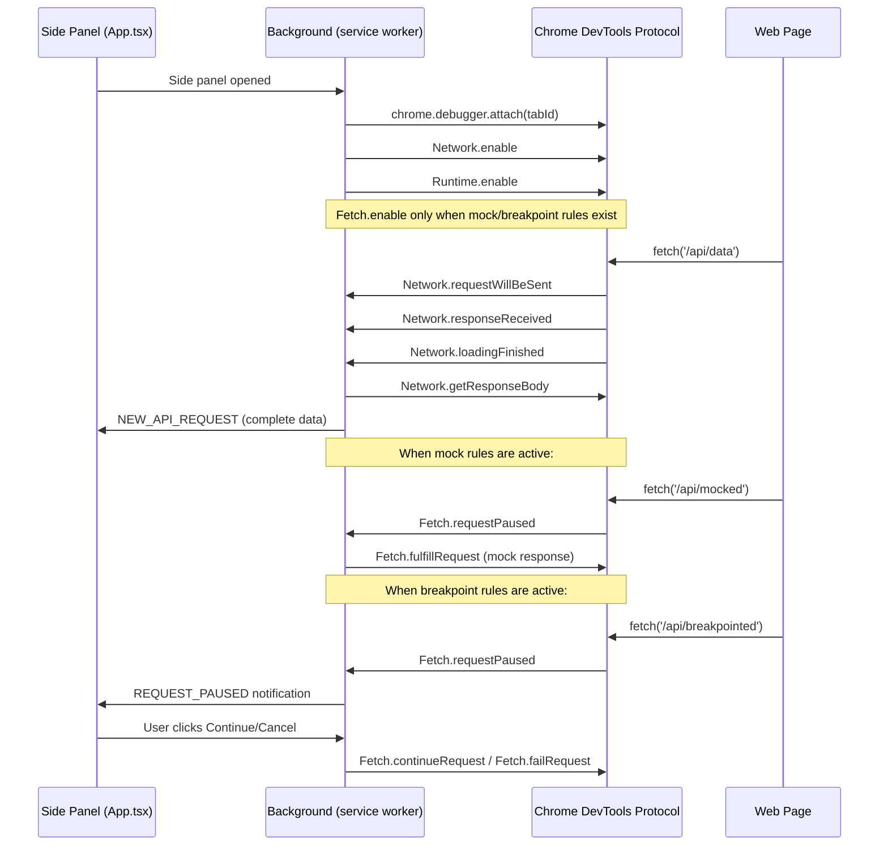

# fix: Migrate request capture from page-context monkey-patching to chrome.debugger CDP

## Overview

Replace the current `injected.js` monkey-patching approach (which overrides `window.fetch`, `XMLHttpRequest`, and `console.error` in the page context) with the Chrome DevTools Protocol via `chrome.debugger` API. This eliminates all page-context modifications that trigger Cloudflare Turnstile and other anti-bot systems.

## Problem Frame

The extension injects `injected.js` into every page, which monkey-patches `window.fetch`, `XMLHttpRequest.prototype.open/send/setRequestHeader`, and `console.error`. Cloudflare Turnstile performs integrity checks on these native APIs (e.g., `fetch.toString()` returns non-native code, prototype chain is modified). When it detects tampering, it blocks the page with a challenge failure. This makes the extension unusable on any site protected by Turnstile, Akamai Bot Manager, or similar systems.

## Requirements Trace

- R1. Pages protected by Cloudflare Turnstile (and similar anti-bot systems) must function normally when the extension is active
- R2. Full request/response capture must be preserved (URL, method, headers, body, status, timing)
- R3. Mock response functionality must continue working
- R4. Breakpoint (request pause) functionality must continue working
- R5. Console error capture must continue working
- R6. DOM field search/highlight functionality must be unaffected
- R7. The extension must handle debugger lifecycle gracefully (attach, detach, tab close, navigation, user cancellation)

## Scope Boundaries

- The yellow "debugging this browser" infobar is an accepted tradeoff for a developer tool
- No changes to the side panel React UI beyond updating message type handling and adding a breakpoint notification banner with Continue/Cancel buttons
- No changes to DOM field search/highlight system in content.js
- No attempt to suppress or bypass the debugger infobar
- WebSocket frame capture is out of scope (not currently supported)

## Context & Research

### Relevant Code and Patterns

- `public/injected.js` — current monkey-patching implementation (to be deleted)
- `public/content.js` — bridge script; lines 1-78 handle network relay and breakpoint overlay (to be stripped); lines 205-543 handle DOM search/highlight (to be preserved)
- `public/background.js` — service worker; request/error storage, mock/breakpoint rule management
- `public/manifest.json` — needs `"debugger"` permission, remove `web_accessible_resources`
- `src/sidepanel/App.tsx` — message listener for `NEW_API_REQUEST`, `NEW_CONSOLE_ERROR`

### External References

- [chrome.debugger API](https://developer.chrome.com/docs/extensions/reference/api/debugger) — attach/detach lifecycle, sendCommand, onEvent, onDetach
- [CDP Network Domain](https://chromedevtools.github.io/devtools-protocol/tot/Network/) — passive request/response capture with `getResponseBody`
- [CDP Fetch Domain](https://chromedevtools.github.io/devtools-protocol/tot/Fetch/) — request interception for mocking (`fulfillRequest`) and breakpoints (`requestPaused`)
- [CDP Runtime Domain](https://chromedevtools.github.io/devtools-protocol/tot/Runtime/) — `exceptionThrown` and `consoleAPICalled` for error capture

## Key Technical Decisions

- **Use `chrome.debugger` over `chrome.webRequest`**: `webRequest` cannot read response bodies, which is the core feature. `chrome.debugger` is the only MV3 API that provides full request/response body access without page-context injection.

- **Network domain for passive capture, Fetch domain only for mock/breakpoint**: Network domain observes all traffic with zero request latency. Fetch domain pauses requests (adding 1-5ms IPC round-trip), so it should only be enabled when mock or breakpoint rules are active. This dual-domain approach gives best performance for passive observation while enabling interception when needed. **Deduplication**: When Fetch domain intercepts a request (mock or breakpoint), Network domain still fires events for it. Mocked requests must be tracked by their `networkId` (from `Fetch.requestPaused`) so the Network domain handler can skip them and avoid double-capture. For continued breakpoint requests, the Network domain handler is the authoritative emitter.

- **Breakpoint check before mock check (preserving current behavior)**: The current `injected.js` checks breakpoints first (line 147), then mocks (line 170). This order is preserved: breakpoints let the user inspect/cancel before any mock substitution occurs. If the user continues past a breakpoint, the mock check then runs.

- **Port-based side panel lifecycle signaling**: Introduce `chrome.runtime.connect` with port name `'sidepanel'` for detecting side panel open/close. This is a new communication pattern — ports are used solely for lifecycle detection (open/close), while existing `chrome.runtime.sendMessage` continues to handle all data queries and notifications. The port boundary is: port connect = attach debugger, port disconnect = detach debugger.

- **Attach on side panel open, detach on close**: Minimizes infobar exposure. The debugger is only active when the user is actively using the extension. Active debugger sessions keep the MV3 service worker alive, avoiding idle termination issues.

- **Move breakpoint UI from page overlay to side panel**: The current breakpoint overlay injects DOM into the page (content.js lines 80-203). With CDP `Fetch.requestPaused`, the request is paused at the browser's network layer — no page-context interaction is needed. The side panel can show a "Request Paused" notification with Continue/Cancel buttons, which is cleaner and avoids any page-context modification.

- **Delete `injected.js` entirely**: All its functionality (fetch interception, XHR interception, console.error capture, mock responses, breakpoint pausing) maps directly to CDP domains. No fallback mode is planned — the debugger approach is strictly superior for a developer tool.

- **CDP domain usage is scoped by convention**: The `debugger` permission grants full CDP access (including `Runtime.evaluate`, DOM manipulation, etc.). This extension uses only `Network`, `Fetch`, and `Runtime` domains. No `Runtime.evaluate` calls are made. This constraint should be documented and maintained — it limits the blast radius if the extension is compromised and simplifies security audits.

## Open Questions

### Resolved During Planning

- **Can chrome.debugger coexist with DevTools?** Yes, Chrome 63+ supports multiple concurrent debugging clients. Both the extension debugger and DevTools can attach simultaneously.
- **Does chrome.debugger work from MV3 service workers?** Yes, the full API is available in the service worker context.
- **How to handle `Network.getResponseBody` timing?** Must wait for `Network.loadingFinished` before calling `getResponseBody`. Calling after `responseReceived` alone will error.

### Deferred to Implementation

- **Exact approach for re-attaching after service worker restart**: May need to persist attached tab IDs in `chrome.storage` and re-attach on worker start. Active debugger sessions keep the worker alive, but if Chrome terminates the worker, in-flight `pendingRequests` are lost (acceptable for a dev tool). The `apiRequests`/`consoleErrors` Maps are already lost on worker restart today — this is a pre-existing limitation.
- **Whether `Fetch.enable` patterns need re-enabling after navigation**: Research suggests Network domain persists across navigations, but Fetch patterns may need re-enabling. Verify during implementation.
- **Streaming/SSE response handling**: For long-lived connections (Server-Sent Events, streaming), `Network.loadingFinished` may never fire. These requests will sit in `pendingRequests` indefinitely. Consider a timeout (e.g., 60 seconds) to emit partial data and clean up, or emit on `Network.dataReceived` for streaming types.
- **`error` vs `unhandledrejection` distinction in CDP**: `Runtime.exceptionThrown` does not directly expose whether an exception is synchronous or a rejected promise. May need to inspect `exceptionDetails.text` or exception subtype to distinguish. Accept that the distinction may be approximate.

## High-Level Technical Design

> *This illustrates the intended approach and is directional guidance for review, not implementation specification. The implementing agent should treat it as context, not code to reproduce.*

## Implementation Units

- [ ] **Unit 1: Add debugger permission and remove injected.js references**

**Goal:** Update manifest for chrome.debugger access and remove page-context injection infrastructure.

**Requirements:** R1 (eliminate page-context modification)

**Dependencies:** None

**Files:**
- Modify: `public/manifest.json`
- Delete: `public/injected.js`
- Modify: `public/content.js`
- Modify: `public/background.js`

**Approach:**
- Add `"debugger"` to `permissions` array in manifest
- Remove the `web_accessible_resources` block (no longer exposing `injected.js`)
- In `content.js`: remove the `<script>` injection (lines 9-15), remove `window.postMessage` listeners for `API_DEBUGGER_REQUEST` and `API_DEBUGGER_ERROR` (lines 18-44), remove `CONTENT_SCRIPT_READY` message (line 47), remove mock/breakpoint rule forwarding via `window.postMessage` (lines 50-66), remove breakpoint overlay code (lines 68-203), remove the `__reqpaneContentLoaded` guard wrapping (lines 4-7, 543) — restructure as a simple IIFE. Consider changing `run_at` from `"document_start"` to `"document_idle"` since DOM search only works when `document.body` exists
- Preserve: DOM field search/highlight system (lines 205-541) and its message listeners
- In `background.js`: remove the `API_REQUEST_CAPTURED` handler (lines 55-79), `CONSOLE_ERROR_CAPTURED` handler (lines 101-121), and `CONTENT_SCRIPT_READY` handler (lines 143-157) — all become dead code. Remove the tab broadcast loops from `SAVE_MOCK_RULES` (lines 169-177) and `SAVE_BREAKPOINT_RULES` (lines 192-201) handlers — rules are now applied via CDP `Fetch.enable` directly, not forwarded to content scripts

**Patterns to follow:**
- Existing manifest.json structure for permissions

**Test scenarios:**
- Happy path: Extension loads without errors after manifest changes; content.js still handles `SEARCH_DOM_FOR_VALUE`, `BATCH_SEARCH_DOM`, `HIGHLIGHT_ELEMENTS`, `CLEAR_HIGHLIGHTS` messages correctly
- Edge case: Pages that previously had `injected.js` loaded do not show residual `__reqpaneInjected` or `__reqpaneContentLoaded` globals

**Verification:**
- Extension installs without permission errors
- `injected.js` is no longer present in the `dist/` build output
- Content script still loads and responds to DOM search messages

---

- [ ] **Unit 2: Implement CDP debugger lifecycle in background.js**

**Goal:** Add debugger attach/detach lifecycle management to the service worker, triggered by side panel open/close and tab lifecycle events.

**Requirements:** R7 (graceful lifecycle handling)

**Dependencies:** Unit 1

**Files:**
- Modify: `public/background.js`

**Approach:**
- Track debugger state per tab: `debuggerState` Map of tabId -> `{ attached: boolean, fetchEnabled: boolean, portRef }`. Knowing whether Fetch is currently enabled avoids redundant `Fetch.disable` calls
- Implement `attachDebugger(tabId)` — calls `chrome.debugger.attach` (protocol version `'1.3'`), enables `Network.enable` and `Runtime.enable`. Conditionally enables `Fetch.enable` if mock or breakpoint rules exist. Handle failure gracefully for restricted URLs (chrome://, chrome-extension://, Chrome Web Store, PDF viewer, New Tab Page)
- Implement `detachDebugger(tabId)` — calls `chrome.debugger.detach`, cleans up state
- Listen for side panel connection via `chrome.runtime.onConnect` with port name `'sidepanel'` (side panel opens a port on mount). Attach debugger to active tab when port connects; detach when port disconnects. This port-based lifecycle is the contract between Unit 2 (background) and Unit 7 (side panel) — both must agree on the port name
- Handle `chrome.debugger.onDetach` for `target_closed`, `canceled_by_user`, `replaced_with_devtools` — clean up state and notify side panel via `DEBUGGER_STATUS` message with `status: 'detached'` and `reason` field
- Handle `chrome.tabs.onRemoved` — clean up debugger state (existing handler already cleans apiRequests/consoleErrors)
- Handle `chrome.tabs.onUpdated` with `status === 'loading'` — clear pending requests map (debugger stays attached across navigations). Existing `apiRequests`/`consoleErrors` clearing behavior is unchanged
- Handle `chrome.tabs.onReplaced` — detach from old tab, attach to new tab if side panel is open
- When active tab changes while side panel is open, detach from old tab and attach to new tab. Serialize tab-switch operations to prevent race conditions from rapid switching (e.g., flag-based guard that drops intermediate switches)

**Patterns to follow:**
- Existing tab lifecycle handlers in `background.js` (lines 211-228)
- Existing Map-based per-tab state management

**Test scenarios:**
- Happy path: Debugger attaches when side panel opens, detaches when it closes
- Happy path: Debugger stays attached across same-tab navigation; pending requests are cleared
- Edge case: User clicks "Cancel" on infobar — `onDetach` fires with `canceled_by_user`, side panel is notified
- Edge case: Tab is closed while debugger is attached — cleanup completes without errors
- Edge case: Tab is replaced (discard/hibernate) — re-attach to new tab
- Edge case: Active tab switches while side panel is open — debugger transfers to new tab
- Error path: `chrome.debugger.attach` fails (e.g., chrome:// page) — fail gracefully, notify side panel

**Verification:**
- No orphaned debugger sessions after tab close or side panel close
- Yellow infobar appears only when side panel is open
- No errors in service worker console during tab lifecycle transitions

---

- [ ] **Unit 3: Implement CDP Network domain request capture**

**Goal:** Replace the injected.js fetch/XHR monkey-patching with passive CDP Network domain event listeners for full request/response capture.

**Requirements:** R2 (full request/response capture)

**Dependencies:** Unit 2

**Files:**
- Modify: `public/background.js`

**Approach:**
- Add a `pendingRequests` Map (requestId -> partial request data) to accumulate data across CDP events
- Handle `Network.requestWillBeSent` — store URL, method, headers, postData, timestamp, type (Fetch/XHR/Document). Use `params.request.postData` for body; if `hasPostData` is true but `postData` is absent, call `Network.getRequestPostData`
- Handle `Network.responseReceived` — merge status, statusText, response headers, mimeType into the pending request
- Handle `Network.loadingFinished` — call `Network.getResponseBody(requestId)`, parse JSON bodies when content-type matches, assemble complete request object, emit to side panel via existing `NEW_API_REQUEST` message, store in `apiRequests` Map. **Skip requests that were mocked via Fetch domain** — track mocked `networkId`s in a Set and check before emitting. Truncate response bodies larger than 5MB to prevent service worker memory exhaustion
- Handle `Network.loadingFailed` — emit failed request with error text
- Filter by resource type: only capture `XHR` and `Fetch` types (matching current behavior). Ignore `Document`, `Stylesheet`, `Image`, `Script`, etc. Note: CDP may classify some `fetch('/page.html')` calls as `Document` rather than `Fetch` — accept this minor behavioral difference
- Create a local `matchUrlPattern(url, pattern, method?)` function in background.js for URL pattern matching with wildcard support, used by both mock and breakpoint matching. **Important**: current patterns use substring matching (`url.includes(pattern)`) for non-wildcard patterns, but CDP `Fetch.enable` uses full-URL glob matching. Wrap non-wildcard patterns with `*pattern*` when passing to CDP `Fetch.enable` to preserve substring semantics. The in-handler matching must use the same substring semantics as the current implementation
- Wrap `Network.getRequestPostData` calls in try/catch — fall back to `'[Unable to retrieve request body]'` on failure (matching current injected.js error handling pattern)
- Map CDP data to existing `ApiRequest` type shape (id, type, method, url, requestHeaders, requestBody, status, statusText, responseHeaders, responseBody, duration, error, pageUrl, pageTitle)
- For `pageUrl`/`pageTitle`: query `chrome.tabs.get(tabId)` once per attachment and cache

**Patterns to follow:**
- Existing `apiRequests` Map storage and `MAX_REQUESTS_PER_TAB` limit in `background.js`
- Existing `ApiRequest` type in `src/sidepanel/types.ts`

**Test scenarios:**
- Happy path: GET request captured with full URL, method, headers, status, response body, timing
- Happy path: POST request captured with request body (JSON payload)
- Happy path: Failed request (network error) captured with error message
- Edge case: Large response body (>1MB) — handle gracefully if `getResponseBody` fails
- Edge case: Non-JSON response (text/html, binary) — store as text or `[Binary content]`
- Edge case: Redirect chain — capture the final response, not intermediate redirects
- Integration: Captured request appears in side panel with same data shape as before (method, status, headers, body, timing)

**Verification:**
- Side panel displays captured requests with all fields populated
- Request timing (duration) is accurate
- Existing request list, filtering, and detail view work without changes

---

- [ ] **Unit 4: Implement CDP Runtime domain console error capture**

**Goal:** Replace the injected.js `console.error` monkey-patch and error event listeners with CDP Runtime domain events.

**Requirements:** R5 (console error capture)

**Dependencies:** Unit 2

**Files:**
- Modify: `public/background.js`

**Approach:**
- `Runtime.enable` is already called during attach (Unit 2)
- Handle `Runtime.exceptionThrown` — map to existing console error shape: id, type (`'error'` or `'unhandledrejection'`), message, filename, lineno, colno, stack, timestamp, pageUrl, pageTitle
- Handle `Runtime.consoleAPICalled` where `params.type === 'error'` — map `args` array to a joined message string (matching current `console.error` capture behavior)
- Emit via existing `NEW_CONSOLE_ERROR` message and store in `consoleErrors` Map

**Patterns to follow:**
- Existing `consoleErrors` Map storage and `MAX_ERRORS_PER_TAB` limit in `background.js`
- Existing console error type shape in `src/sidepanel/types.ts`

**Test scenarios:**
- Happy path: `console.error('test')` captured with correct message
- Happy path: Uncaught exception captured with stack trace, filename, line number
- Happy path: Unhandled promise rejection captured with reason message
- Edge case: `console.error` with object arguments — serialized to string like current behavior
- Integration: Console errors appear in side panel console tab with same display as before

**Verification:**
- Console error tab in side panel shows captured errors with all fields
- Stack traces are present and formatted correctly

---

- [ ] **Unit 5: Implement CDP Fetch domain mock responses**

**Goal:** Replace the injected.js mock response system with CDP Fetch domain interception.

**Requirements:** R3 (mock response functionality)

**Dependencies:** Unit 2, Unit 3

**Files:**
- Modify: `public/background.js`

**Approach:**
- Implement a `updateFetchPatterns(tabId)` function: reads current mock + breakpoint rules, computes combined URL patterns, calls `Fetch.disable` then `Fetch.enable` with updated patterns (CDP does not support incremental updates). If no rules are enabled, call `Fetch.disable` only. If debugger is not attached, store rules normally and apply on next attach
- Modify the `SAVE_MOCK_RULES` handler: persist to storage, then call `updateFetchPatterns` for any attached tabs (replaces the old tab broadcast loop)
- Handle `Fetch.requestPaused` — the handler runs checks in this order: (1) breakpoints first, (2) mocks second (preserving current `injected.js` behavior). For mocked requests: call `Fetch.fulfillRequest` with the mock's status, headers (as `[{name, value}]` array format), and base64-encoded body. Track the `networkId` from the paused event in a `mockedNetworkIds` Set so the Network domain handler (Unit 3) can skip double-capture. For non-matching requests: call `Fetch.continueRequest`
- Also emit a `NEW_API_REQUEST` with `mocked: true` flag for the mocked request so it appears in the side panel

**Patterns to follow:**
- Existing `findMatchingMock` logic in `injected.js` (URL pattern matching with wildcard support)
- Existing `MockRule` type in `src/sidepanel/types.ts`

**Test scenarios:**
- Happy path: Request matching a mock rule receives the configured mock response (status, body, headers)
- Happy path: Non-matching request passes through unmodified
- Happy path: Mocked request appears in side panel with `mocked: true` indicator
- Edge case: Mock rule with `*` wildcard matches correctly
- Edge case: Mock rule with method filter (`GET` only) does not match `POST` requests
- Edge case: Disabling all mock rules (and no breakpoint rules active) removes Fetch interception entirely
- Edge case: Adding a new mock rule while debugger is attached immediately enables Fetch interception for that pattern
- Edge case: Rules saved while debugger is not attached — no error, patterns applied on next attach
- Error path: `Fetch.fulfillRequest` fails — continue the request normally, log error

**Verification:**
- Page receives mock response with correct status and body
- Side panel shows mocked requests with the mock indicator
- Non-mocked requests are not delayed by Fetch interception

---

- [ ] **Unit 6: Implement CDP Fetch domain breakpoints**

**Goal:** Replace the injected.js Promise-based breakpoint system and content.js page overlay with CDP Fetch domain request pausing and side panel notification.

**Requirements:** R4 (breakpoint functionality)

**Dependencies:** Unit 5 (shares Fetch domain event handler)

**Files:**
- Modify: `public/background.js`
- Modify: `src/sidepanel/App.tsx`

**Approach:**
- Modify the `SAVE_BREAKPOINT_RULES` handler: persist to storage, then call `updateFetchPatterns` (same function from Unit 5) for any attached tabs (replaces the old tab broadcast loop)
- In the `Fetch.requestPaused` handler, breakpoints are checked first (before mocks, preserving current behavior). If a breakpoint matches, store the paused request (Fetch-domain `requestId`, tab ID, request details) and notify the side panel via `BREAKPOINT_REQUEST_PAUSED` message
- Side panel receives `BREAKPOINT_REQUEST_PAUSED`, shows an inline notification/banner (not a modal overlay — the side panel is already visible). User clicks "Continue" or "Cancel"
- Side panel sends `RESUME_PAUSED_REQUEST` (with `requestId` and `action`) back to background
- Background calls `Fetch.continueRequest` (continue) or `Fetch.failRequest` with `errorReason: 'BlockedByClient'` (cancel)
- Safety: if the debugger detaches while requests are paused, Chrome automatically cancels the paused requests (no orphaned pauses)
- Remove the breakpoint rule forwarding to content.js
- Add a timeout (e.g., 30 seconds) for paused requests — auto-continue if user doesn't respond, to prevent hanging requests

**Patterns to follow:**
- Existing breakpoint rule structure (`BreakpointRule` type in `types.ts`)
- Existing message patterns between side panel and background

**Test scenarios:**
- Happy path: Request matching a breakpoint rule pauses; side panel shows notification; user clicks Continue; request proceeds normally
- Happy path: User clicks Cancel; request fails with a clear error
- Edge case: Breakpoint and mock rule both match same URL — breakpoint fires first (preserving current `injected.js` behavior). If user continues, mock then applies. If user cancels, request is aborted before mock runs
- Edge case: Tab closes while request is paused — no errors, Chrome cancels the paused request
- Edge case: Debugger detaches (user clicks infobar Cancel) while request is paused — request is cancelled by Chrome
- Edge case: Timeout fires — request auto-continues after 30 seconds
- Integration: Breakpoint notification in side panel appears and disappears correctly; request appears in capture list after resolution

**Verification:**
- Breakpoint pauses requests visibly in the side panel
- Continue and Cancel both work as expected
- No requests hang indefinitely

---

- [ ] **Unit 7: Update side panel for debugger lifecycle awareness**

**Goal:** Add side panel awareness of debugger connection state — connect/disconnect port, show status, handle breakpoint notifications.

**Requirements:** R4, R7

**Dependencies:** Unit 2, Unit 6

**Files:**
- Modify: `src/sidepanel/App.tsx`

**Approach:**
- On mount, open a `chrome.runtime.connect({ name: 'sidepanel' })` port — this signals background.js to attach the debugger (contract with Unit 2)
- On unmount, port disconnects automatically (signals background.js to detach)
- Listen for `DEBUGGER_STATUS` messages from background via `chrome.runtime.onMessage` (status field: `'attached' | 'detached' | 'error'`, with optional `reason` field for detach reasons) — show connection status in the header or settings area. Use a single message type instead of separate `DEBUGGER_DETACHED` type
- Listen for `BREAKPOINT_REQUEST_PAUSED` messages — show a breakpoint notification banner with request details and Continue/Cancel buttons
- Send `RESUME_PAUSED_REQUEST` when user clicks Continue/Cancel
- When `DEBUGGER_STATUS` has `status: 'detached'` and `reason: 'canceled_by_user'` — show a "Capture stopped" indicator with a "Reconnect" button (reconnect re-opens the port)
- Remove dead message type listeners that are no longer sent

**Patterns to follow:**
- Existing `chrome.runtime.onMessage` listener in App.tsx
- Existing state management patterns (useState for UI state)

**Test scenarios:**
- Happy path: Side panel opens, debugger attaches, status shows "Capturing"
- Happy path: Side panel closes, debugger detaches
- Happy path: Breakpoint notification banner appears with request details; Continue/Cancel buttons work
- Edge case: User dismisses infobar — side panel shows "Capture stopped" with reconnect option
- Edge case: Side panel opens on a chrome:// page — shows "Cannot capture on this page"
- Integration: Full flow — open side panel, browse pages, see requests captured, trigger a mock, trigger a breakpoint, continue the breakpoint, close the side panel

**Verification:**
- Debugger status is always accurately reflected in the side panel
- Breakpoint interaction works end-to-end from side panel
- No console errors during normal usage

---

- [ ] **Unit 8: Update CLAUDE.md architecture documentation**

**Goal:** Update the project documentation to reflect the new CDP-based architecture.

**Requirements:** None (documentation hygiene)

**Dependencies:** All other units

**Files:**
- Modify: `CLAUDE.md`

**Approach:**
- Update the Script Execution Flow diagram to show the new architecture: `background.js (CDP) -> App.tsx (side panel)` for network capture, with `content.js` only for DOM features
- Update the File Structure to remove `injected.js` reference
- Update the Message types section to reflect new CDP-related messages
- Note the `debugger` permission in the Chrome Extension Permissions section
- Remove references to `web_accessible_resources` for `injected.js`

**Test expectation: none -- documentation-only change**

**Verification:**
- CLAUDE.md accurately reflects the new architecture

## System-Wide Impact

- **Interaction graph:** The content.js -> background.js relay for network data is eliminated. Background.js now directly receives network events from CDP. Content.js is only used for DOM search/highlight. Side panel communicates directly with background.js (unchanged). The `onInstalled` handler for content script re-injection remains unchanged (still needed for DOM search after extension update).
- **Error propagation:** If `chrome.debugger.attach` fails (e.g., on chrome://, chrome-extension://, Chrome Web Store pages), background.js must notify the side panel via `DEBUGGER_STATUS`. If CDP commands fail (e.g., `getResponseBody` for a large response), the request should still be captured with a null body rather than dropped.
- **State lifecycle risks:** Pending requests in the `pendingRequests` Map must be cleaned up on navigation, tab close, and debugger detach. Paused breakpoint requests must be auto-continued or cancelled on detach to prevent hanging requests. On service worker restart, in-flight `pendingRequests` are lost (acceptable — same limitation as existing `apiRequests`/`consoleErrors` Maps).
- **API surface parity:** The `ApiRequest` and console error types in `types.ts` should not change shape — CDP data must be mapped to the existing type interfaces so the side panel UI works without modification. The `ApiRequest.type` field maps CDP `ResourceType` values: `'Fetch'` -> `'fetch'`, `'XHR'` -> `'xhr'`.
- **Dual-domain deduplication:** When both Network and Fetch domains are active, mocked requests fire events in both domains. The `mockedNetworkIds` Set prevents double-emission. For breakpoint-continued requests, the Network domain is the authoritative emitter (it captures the full response after continuation).
- **Dead message types:** `API_REQUEST_CAPTURED`, `CONSOLE_ERROR_CAPTURED`, `CONTENT_SCRIPT_READY`, `MOCK_RULES_UPDATED`, `BREAKPOINT_RULES_UPDATED` are all removed. New messages: `DEBUGGER_STATUS`, `BREAKPOINT_REQUEST_PAUSED`, `RESUME_PAUSED_REQUEST`.
- **Unchanged invariants:** All existing side panel UI components (request list, detail view, filtering, export, sessions, settings) remain unchanged. The `chrome.storage.local` keys and format for mock rules, breakpoint rules, favorites, and sessions remain unchanged. CORS-opaque responses may now have visible bodies (capability upgrade, not a regression).

## Risks & Dependencies

| Risk | Mitigation |
|------|------------|
| Yellow infobar is disruptive to users | Acceptable for a developer tool; attach only when side panel is open to minimize exposure |
| `getResponseBody` fails for large responses | Catch the error and store null body; still capture all metadata |
| Service worker terminates while requests are paused | Active debugger session keeps worker alive; add timeout for paused requests as safety net |
| CDP event ordering edge cases | Wait for `loadingFinished` before `getResponseBody`; handle `loadingFailed` as a terminal state |
| Breaking change to side panel message types | Map CDP data to existing `ApiRequest` type shape so UI code is unchanged |
| Streaming/SSE responses hang in `pendingRequests` | Deferred to implementation — consider timeout-based cleanup or `dataReceived` emission |
| Rapid tab switching causes interleaved attach/detach | Serialize operations with a transition guard that drops intermediate switches |
| Fetch domain double-capture with Network domain | Track mocked `networkId`s in a Set; Network handler skips known-mocked requests |
| CDP captures sensitive data (auth tokens, cookies, API keys) in request/response headers and bodies | Pre-existing concern (current injected.js also captures this data). Document that captured data includes credentials. Consider opt-in header redaction in future |
| `debugger` permission grants broader CDP access than needed | Scope usage to Network, Fetch, Runtime domains by convention. No `Runtime.evaluate` calls. Document constraint for security audits |
| URL pattern matching semantics differ between current substring matching and CDP glob matching | Wrap non-wildcard patterns with `*pattern*` for CDP; maintain substring semantics in in-handler matching |

## Sources & References

- [chrome.debugger API](https://developer.chrome.com/docs/extensions/reference/api/debugger)
- [CDP Network Domain](https://chromedevtools.github.io/devtools-protocol/tot/Network/)
- [CDP Fetch Domain](https://chromedevtools.github.io/devtools-protocol/tot/Fetch/)
- [CDP Runtime Domain](https://chromedevtools.github.io/devtools-protocol/tot/Runtime/)
- [Chrome 63 multi-client debugger support](https://developer.chrome.com/blog/new-in-devtools-63)
- [Google patched Turnstile CDP detection in Chrome 132-133](https://webscraper.io/blog/google-patches-100-precise-cloudflare-turnstile-bot-check)
